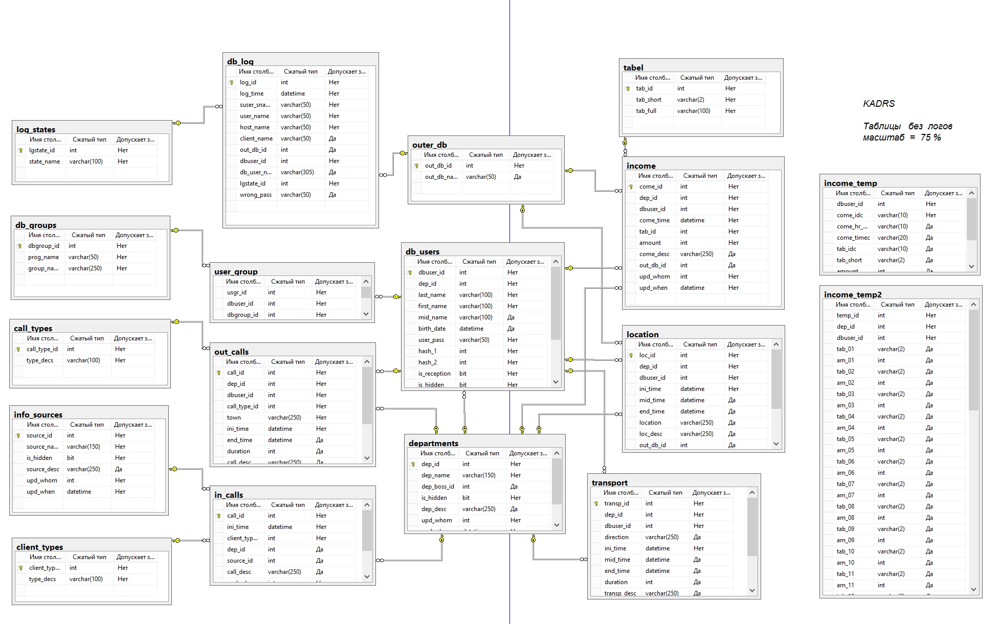

# SQL_Kadrs
Some stored procedures & main daigram for Kadrs department.

Take a look: 

Diagrams: 
	<a href="Screenshots/main_diagram.jpg">main diagram</a>.

Stored procedures:
<ul>
	<li><a href="Procedures/sp_in_calls_upd.sql">sp_in_calls_upd.sql</a>,</li>
	<li><a href="Procedures/sp_income_new.sql">sp_income_new.sql</a>,</li>
	<li><a href="Procedures/sp_income_upd_pack.sql">sp_income_upd_pack.sql</a>,</li>
	<li><a href="Procedures/sp_user_upd_depts.sql">sp_user_upd_depts.sql</a>.</li>
</ul>

